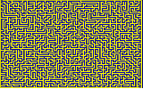

# CPCBasic Unchained - Run CPC BASIC in a Browser

CPCBasic lets you run CPC BASIC programs in a browser. The supported BASIC style is known as Amstrad CPC 6128 Locomotive BASIC 1.1.
BASIC programs are compiled to JavaScript which can be run in the browser. A library provides the functionality of the commands that are not directly available in JavaScript.

CPCBasic Links:
[CPCBasic Demo](https://benchmarko.github.io/CPCBasic/cpcbasic.html?example=cpcbasic),
[Colors CPC Demo](https://benchmarko.github.io/CPCBasic/cpcbasic.html?example=colors),
[Source code](https://github.com/benchmarko/CPCBasic/),
[HTML Readme](https://github.com/benchmarko/CPCBasic/#readme),

## Features

- Run old an new BASIC programs in a browser
- "Wrap factor" Speed: Frame Fly and other events in real-time, calculations as fast as possible
- CPC Basic Unchained: Less restrictions, extended by new features, breaking out of the CPC box
- BASIC compiler and not just interpreter
- Lots of memory, no memory full
- Runs locally without a server (even on mobile devices, but without input)
- HTML5 / JavaScript without external libraries

]

]
]
]
]

More examples are in the sample library [CPCBasicApps](https://github.com/benchmarko/CPCBasicApps/#readme). They are included in CPCBasic as [apps](https://benchmarko.github.io/CPCBasic/cpcbasic.html?database=apps).

## Why CPCBasic

There are several great CPC emulators which emulate a complete CPC with exact timing and allow demos to run, pushing CPC hardware to its limits.

With CPC Basic we do not get that accuracy. But if we compile it to JavaScript, can we achieve a similar or faster speed than the assembler programmed functionality that runs on a CPC or emulator?

## Usage

- Just open cpcbasic.html in a browser.
  The user interface shows several boxes, which can be reduced and expanded by pressing the **green** buttons.
- Use the first selection field select the example library: CPCBasic *examples* or CPCBasicApps *apps*.
- Use the second selection field to select a sample program. It will reset the CPC, and run the program.
- If you change the BASIC program, press the **Run** button to compile and run the BASIC program in JavaScript. The **Compile only** button compiles the program without running it.
- If the focus is on the CPC screen, keystrokes will be detected by a running program.
  The *Input* window is an alternative way to send input to the CPC. This works also on mobile devices.
- The **Break** button stops the simulation. You can continue with the "Continue" button.
- The **Reset** button resets the CPC.
- The **Screenshot** button creates a screenshot of the current CPC screen.
- The **Sound** button activates sound.
- Textual output is also written to the *Console* Window. This is useful for copying and pasting the output.
- The *Variables* window allows you to see the variables used by the program.
- In the *JavaScript* window you will see the compiled JavaScript code. It can be changed and then executed with the *Run* button in this window. So it is possible to use the simulated CPC directly with JavaScript.
- The **Reload** button reloads the page with the current settings. (Please note that changes to the script are lost!)
  - If you use *Reload* with sound activated, sound need to be activated again. Just do a user action, e.g. click somewhere. This is a browser limitation.
- The **Help** button opens the readme file on the server.

## Restrictions

- CPCBasic is still in progress and not complete or accurate. The goal is that most BASIC programs run without change.
- It is BASIC only and can not execute Z80 machine code
- Unimplemented commands: *AUTO*, *CAT*, *CONT*, *COPYCHR$*, *CURSOR*, *DELETE*, *EDIT*, *FILL*, *LIST*, *MASK*, *NEW*, *OPENOUT*, *OUT*, *PRINT#8/#9*, *RENUM*, *RESUME*, *SAVE*, *SPEED INK/KEY/WRITE*, *WIDTH*, *WRITE #8/#9*
- Sound: More hardware volume envelopes
- No direct input mode for BASIC commands, e.g. *LIST*, *RENUM*,...; no visible cursor
- No complete check of the BASIC program
- Almost no type checking
- Variables typed with *DEFINT*, *DEFREAL* or *DEFSTR* are different from those with type extension:
  `defint a: a=1: a%=2: ?a,a%`
- *ON ERROR GOTO* and *RESUME* without line number do not fully work because this would require to single step every instruction
- Resulting JavaScript looks ugly because there is no *GOTO* in JavaScript. Control structures need to be converted to *GOTO* because for some commands and events it is necessary to jump out a block
- Interpreted CPC BASIC may contain lines of arbitrary content if they are not executed, e.g. comments without marking them as comments. The CPCBasic compiler does not allow this.
- That is CPC BASIC: `a(3]=6: ?a[3)`. Do we really want to allow that?
- A lot more

## Fixed Restrictions

- [fixed: *TEST*, *TESTR* can not distinguish between pens of the same color]
- [fixed: Changing the color with *INK*, existing drawings will not be changed and the colors will
  not flash. Currently you have to redraw the screen with another color to get a flashing effect.]
- [fixed: Comparison with equal in assignment is possible now: `a=0: x=(a=0): ?x`, returns -1 for true as on the CPC]
- [fixed: No sound]
- [fixed: *ENT* (tone envelopes); hardware volume envelopes with sepcial *ENV* syntax "="]
- [fixed: RESTORE for lines without *DATA*: search next *DATA* line]
- [done: Separate sample library; sample category]

## Extensions and Features

- *MODE 3*: High resolution with real 640x400 pixel and 16 colors; 8x8 pixel characters: [Rectangles](https://benchmarko.github.io/CPCBasic/cpcbasic.html?example=rectangles)
- *|MODE,n*: Change mode without *CLS* (experimental)
- Computations are not limited to 16 bits
- *PEEK&POKE* can access "large" memory, not only 64 KB or 512 KB.

## Programming hints

- CPCBasic is BASIC with "wrap factor". However, do not use busy waiting. Put in *FRAME* or *CALL &BD19* commands.
  - There is a special feature for the *INKEY$* function: If it returns no key more than once during a frame, a *FRAME* is implicitely called.
- Use URL parameter "tron=true" to activate line tracing mode with *TRON* and *TROFF*
- Use *OPENIN* and *INPUT#9* to load data from a file in the current "directory"
- If the program is complete (that means, no *MERGE* or *CHAIN MERGE* inside), line number destinations are checked for existence. For example, if the *line number* in *GOTO line* does not exist, the compilation fails.
- Most commands and functions are checked for number of arguments but not for argument types.

## Possible Future Enhancements

- Drag and drop BASIC programs (tokenized or ASCII) into CPCBasic
- DSK images support
- Pause key
- Create buttons for the keys that the BASIC program checks (useful for e.g. mobile devices)
- RSX extension libraries / plugins programmed in JavaScript
- Can we detect Busy Loops and insert *FRAME* automatically?
- Access screen memory with *PEEK&POKE*
- Shall we support hardware scrolling with *OUT* or is it already a hardware emulation feature?
- Extension: More colors, e.g. 256
- Optimizations of the resulting JavaScript code
- Further checks during compile time
- Smooth characters from 8x8 to 8x16

## Links

- [CPC 6128 User Instructions](http://www.cpcwiki.eu/manuals/AmstradCPC6128-hypertext-en-Sinewalker.pdf) - (I have the German version)

- [ROM-Listing CPC 464/664/6128](http://www.cpcwiki.eu/index.php/ROM-Listing_CPC_464/664/6128) - German, excellent information

- [Das Scheider CPC Systembuch](https://k1.spdns.de/Vintage/Schneider%20CPC/Das%20Scheider%20CPC%20Systembuch.pdf) - German, excellent information

- [Locomotive BASIC](https://www.cpcwiki.eu/index.php/Locomotive_BASIC) - Description of the CPC Basic Dialect

- [Disassembly of Locomotive BASIC v1.1](http://cpctech.cpc-live.com/docs/basic.asm) - If you do not have the ROM listing at hand

- [The story of Amstrad’s amazing CPC 464](https://www.theregister.co.uk/2014/02/12/archaeologic_amstrad_cpc_464/)

- [CPCemu](http://www.cpc-emu.org/) - CPC Emulator, currently version 1.7, hopefully there will be an update soon ...

- [Arnold TNG - The Warp factor](http://www.yasara.org/cpc/index.html) - Modified Arnold CPC emulator at various speed levels.

- [Simple Web Basic](https://yohan.es/swbasic/) - A link collection of basic interpreters for the Web (2010)

- [qb.js: An implementation of QBASIC in Javascript](http://stevehanov.ca/blog/?id=92)

- [JSBasic - A BASIC to JavaScript Compiler](https://www.codeproject.com/Articles/25069/JSBasic-A-BASIC-to-JavaScript-Compiler), with
  [Demo: SpaceWar](http://jsbasic.apphb.com/default.aspx?sourceCode=SpaceWar)

- [Top Down Operator Precedence](http://crockford.com/javascript/tdop/tdop.html) - Douglas Crockford, 2007-02-21. CPCBasic uses this approach.

- [BM Benchmark Suite](https://github.com/benchmarko/BMbench) - A collection of simple benchmarks in various programming languages

- [Locomotive Software](https://www.cpcwiki.eu/index.php/Locomotive_Software) - The developer of CPCs BASIC and operating system

### **mv, 11/2019**
